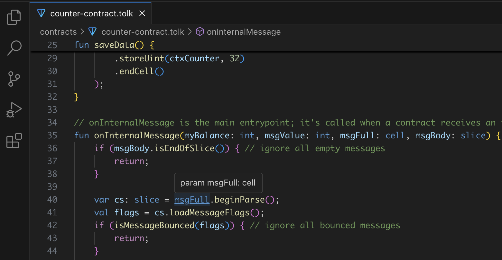

## ⚠️ DEPRECATION NOTICE

TOLK support has been moved to "TON" VS Code extension.  
This extension (tolk-vscode) is unpublished and no longer maintained.

**→ Proceed to [ton-language-server](https://github.com/ton-blockchain/ton-language-server)**

*↓ The below is left for history only*

# Tolk Language Support for VS Code

**Tolk** is a new language for writing smart contracts in TON. Think of Tolk as the "next‑generation FunC".
Tolk compiler is literally a fork of FunC compiler, introducing familiar syntax similar to TypeScript,
but leaving all low-level optimizations untouched.

This extension fully covers Tolk grammar and will be kept up to date with Tolk evolution.

## How to install

Just search for "Tolk" in VS Code Marketplace. Here is a [direct link](https://marketplace.visualstudio.com/items?itemName=ton-core.tolk-vscode).

## Features

* Syntax highlighting
* Auto-completion of global symbols and local variables
* Go to definition
* Brief info on symbol hover
* Code formatting
* Rename local variables
* Diagnostics of using undefined symbols (*"Enable experimental diagnostics* in settings)
* Auto-detect stdlib functions from `node_modules` (common for blueprint) and default system paths

Most missing features are "find usages" and auto-inserting imports. I hope to have enough time for implementation soon.

Watch a short video of how it looks like:

https://github.com/user-attachments/assets/aa7c6fef-6139-4b96-ac2f-75fc9d60c5cc

## About Tolk SDK auto-detection

Tolk offers many standard functions, like `beginCell()`, `createEmptyTuple()`, and others.
They are listed in `common.tolk` and related files, automatically discovered by Tolk compiler.

This extension automatically also discovers them automatically (to provide auto-completion and so on).
**Most likely, you don't have to do anything — it just works**. Below is an explanation.
For example, if you use [blueprint](https://github.com/ton-org/blueprint), 
it automatically installs [tolk-js](https://github.com/ton-blockchain/tolk-js),
and therefore, folder `node_modules/@ton/tolk-js/` exists in your file structure.
Inside, there are `common.tolk`, `tvm-dicts.tolk`, and others. 

If you don't use blueprint, this extension searches for default system paths.
For example, on Linux, having installed a fresh TON package via `apt`,
Tolk standard library was also installed inside `/usr/share/ton`.

Anyway, you can open disable auto-detection in extension settings for a current workspace
and manually specify `tolkCompilerVersion` and `stdlibFolder`.

So, the algorithm is as follows:
* if auto-detection is disabled in settings, use manual settings
* look in `node_modules/@ton/tolk-js`
* look in default system paths (apt, homebrew, Chocolatey)
* can't detect, diagnostics are disabled and a warning is shown

Invoke *"Show detected Tolk SDK"* from the command palette to view current values. 
This command also clears cache (helpful in corner cases, e.g. you opened an empty project, detection failed,
then you did `npm install`, use this command to re-detect).

## Brief info about implementation

Historically, this extension has been cloned from [vscode-func](https://github.com/tonwhales/vscode-func)
and completely refactored.

It's implemented via LSP (Language Server Protocol). Parsing is implemented via [tree-sitter-tolk](tree-sitter-tolk).
Unparsed nodes are treated as syntax errors. All symbols are kept in memory, assuming that Tolk projects are small enough. 

There is a lot to improve both in functionality and implementation, but anyway, 
basic everyday needs are definitely satisfied. 

## Building & running locally

1. `yarn install`
2. `yarn watch` (makes `dist/` folder)
3. Open this project in VSCode (even if you develop in JetBrains :)), tab *"Run and Debug"*, button *"Launch Extension"*

## Developing and updating grammar

See [tree-sitter-tolk folder](tree-sitter-tolk).
